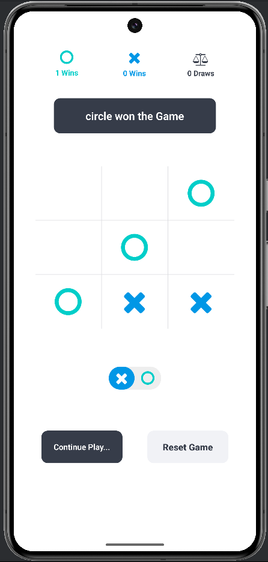

A simple and fun implementation of the classic Tic Tac Toe game built using **React Native**. Challenge a friend in two-player mode and enjoy a smooth gaming experience on your mobile device.

---

## 🚀 Features

- 🎮 Two-player mode on the same device  
- ✨ Responsive UI with clean, intuitive design  
- 🔁 Reset button to quickly start a new game  
- 💥 Winning highlight for the player  
- 🧠 Logic handles all game states including win, draw, and ongoing turns  

---

## 🛠️ Tech Stack

- **React Native**  
- **JavaScript**   

---

## 📱 Screenshots



<p float="left">
  
  
</p>

---

## 📦 Installation

1. **Clone the repository**  
   ```bash
   git clone https://github.com/aryantomar6200/TicTacToe-ReactNative.git
Navigate to the project directory

bash
Copy
Edit
cd TicTacToe-ReactNative
Install dependencies

bash
Copy
Edit
npm install
Start the app

bash
Copy
Edit
npx expo start
Scan the QR code with the Expo Go app on your phone to play!

✅ How to Play
The game is played on a 3x3 grid.

Two players take turns marking the spaces (X and O).

The first player to get 3 of their marks in a row (vertically, horizontally, or diagonally) wins!

If all 9 squares are filled and no player has won, the game ends in a draw.

💡 Future Improvements
Add single-player mode with AI

Implement game history or scoreboard

Add sound effects and animations
